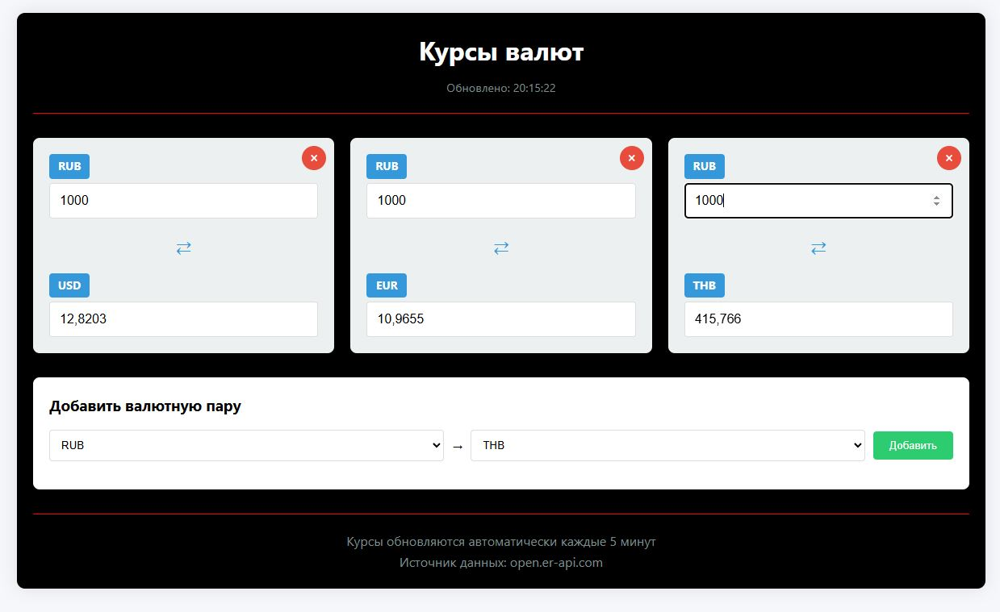
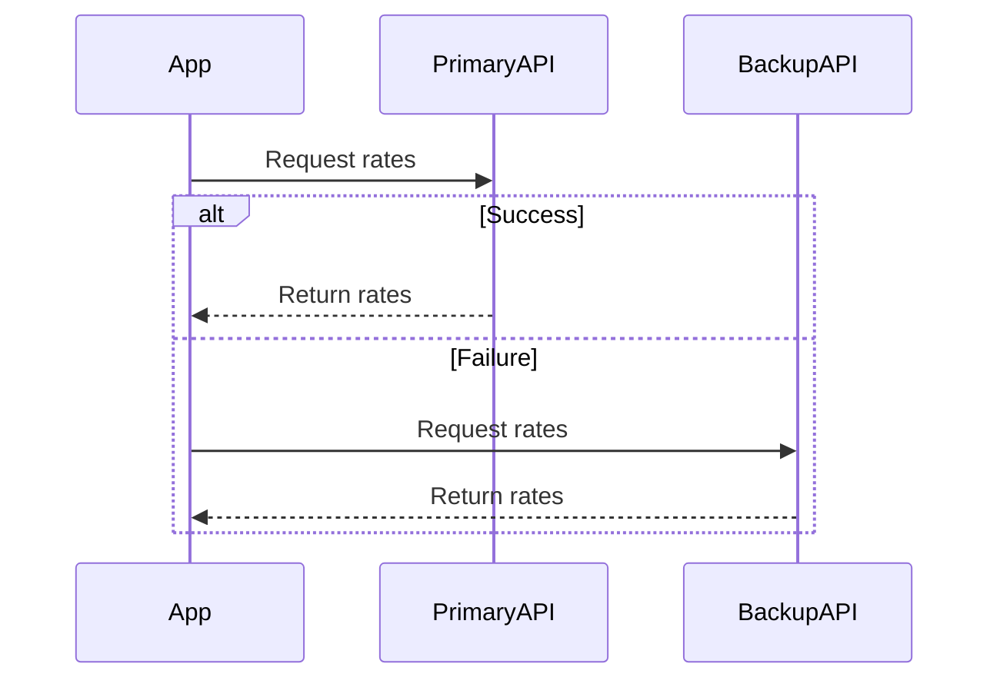

# 💱 Currency Converter App

A responsive SPA for tracking currency exchange rates with real-time conversion.

<p align="center">
  
</p>

## ✨ Features

- 📊 Display multiple currency pairs
- 🔄 Instant conversion calculation
- ➕ Add/remove currency pairs
- 💾 Persistent settings (localStorage)
- ⏱ Auto-refresh every 5 minutes
- 📱 Mobile-friendly design

## 🛠 Tech Stack

| Technology | Purpose |
|------------|---------|
| React 18   | UI Framework |
| TypeScript | Type Safety |
| MobX       | State Management |
| Axios      | API Communication |

## 🚀 Quick Start

Installation
```bash
# Clone the repository
git clone https://github.com/yourusername/currency-converter.git

# Navigate to project directory
cd currency-converter

# Install dependencies
npm install

# Start development server
npm start
```

## 🌐 API Integration

The application uses two reliable exchange rate APIs:

    Primary: Open Exchange Rates API

    Fallback: Frankfurter API

Rates are automatically updated every 5 minutes.



Made with ❤️ by [D13young]